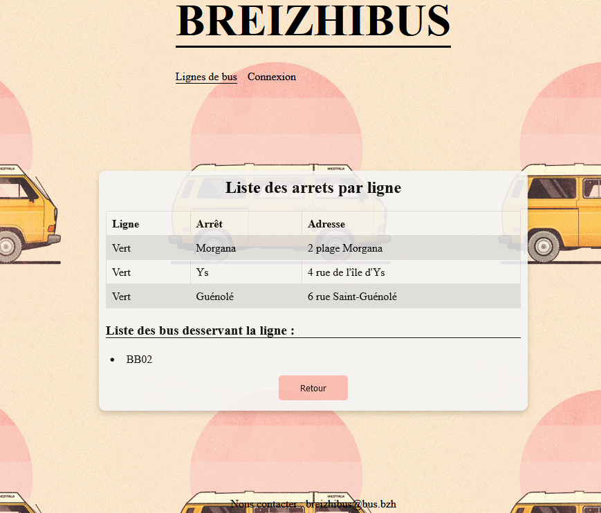
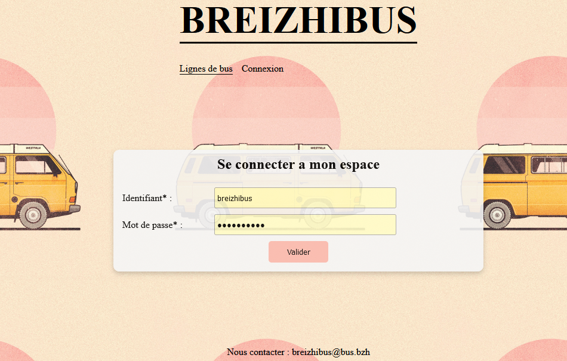
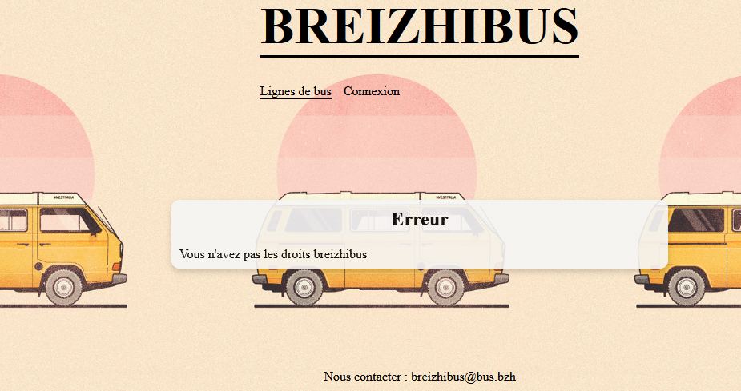
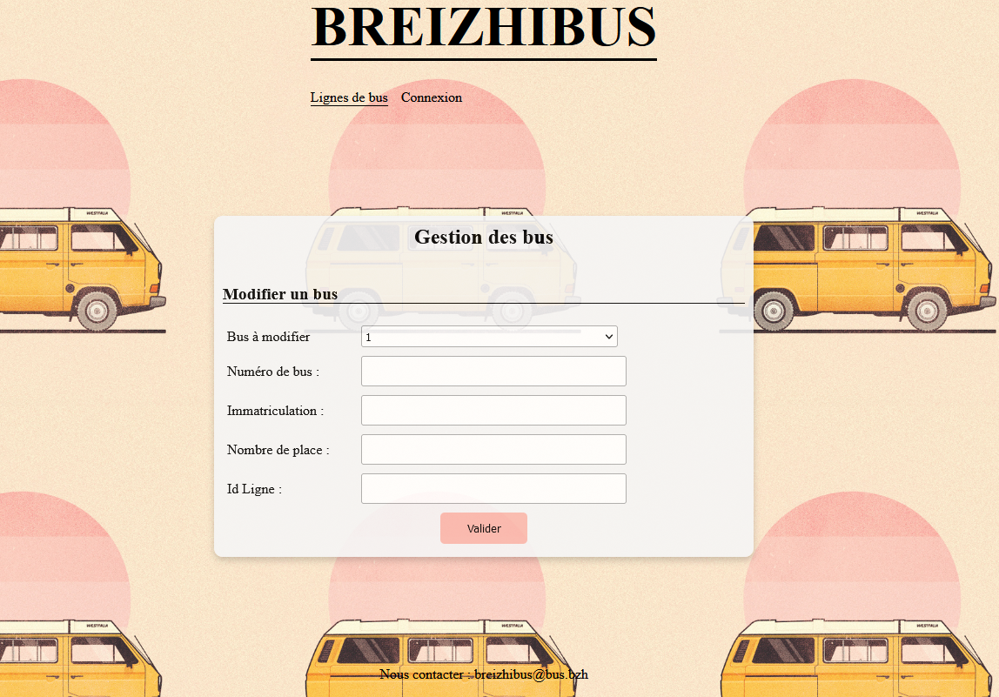
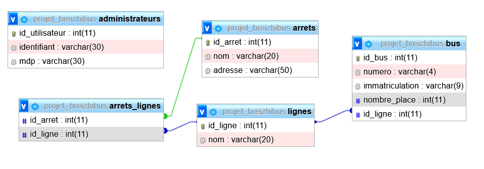

# Breizhibus : Gestion des lignes de bus en ligne
Rédaction d'un [cahier des charges](CDC_Breizhibus_vB.pdf) pour la création du site de Breizhibus permettant la gestion des lignes de bus, en utilisant HTML/CSS et Flask pour le serveur.

## Contexte du projet
Breizhibus souhaite informatiser la gestion de ses lignes de bus. La société souhaite proposer une appli qui permet :
-	aux usagers de consulter les lignes de bus et les arrêts,
-	à ses employés de mettre à jour simplement les données.

## Maquette
Breizhibus souhaite informatiser la gestion de ses lignes de bus. La société souhaite proposer une appli qui :
- page de consultation d'une ligne :</br>
</br>
- page de connexion :</br>
</br>
- page d'erreur de droits :</br>
</br>
- page de gestion des bus et lignes :</br>
</br>

## Base de données
Toutes les données sous la forme d'une base relationnelle MySQL [breizhibus.sql](breizhibus.sql)</br>
</br>


## Pré-requis 
- Création d'un environnement :  ```$ pip install -r requirements.txt```
- Exécution avec Flask :  ```$ python -m flask run```

